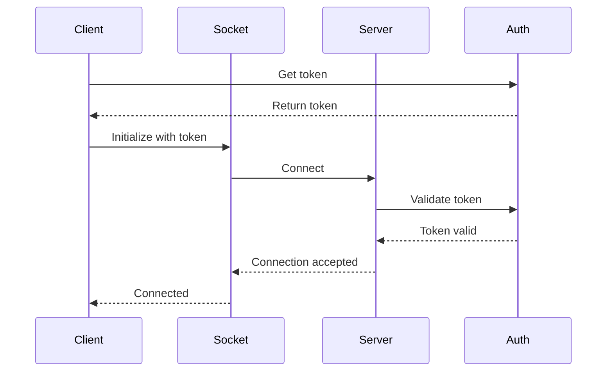
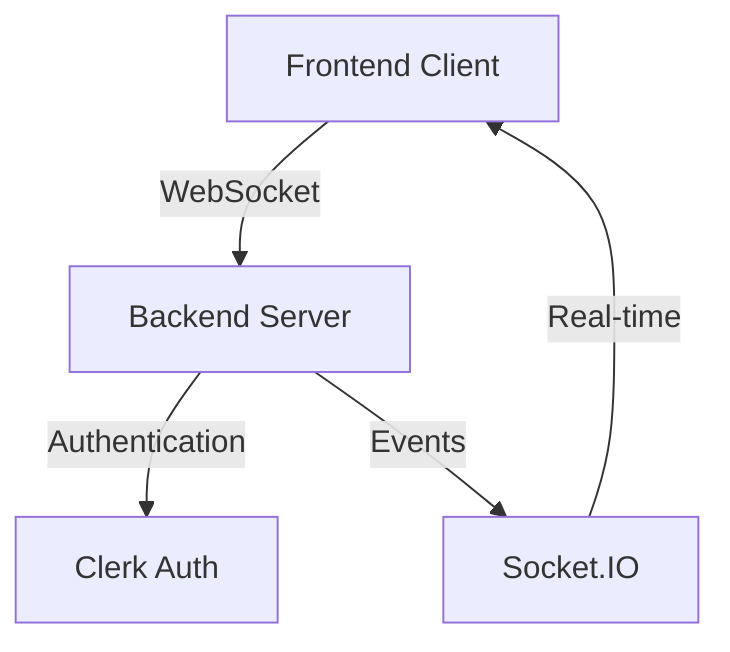

# WebSocket Frontend Integration Guide

## Overview

This guide provides comprehensive documentation for integrating WebSocket functionality in your frontend application using Socket.IO and React. It covers everything from basic setup to advanced features, with a focus on real-time chat functionality.

## Table of Contents

1. [Quick Start](#quick-start)
   - Installation
   - Basic Setup
   - Minimal Example
2. [Core Concepts](#core-concepts)
   - WebSocket Architecture
   - Key Components
   - Authentication Flow
3. [Common Patterns](#common-patterns)
   - Real-time Chat
   - Notifications
   - Live Updates
   - Presence System
4. [Implementation Guide](#implementation-guide)
   - Basic Setup
   - Authentication
   - Error Handling
   - State Management
5. [Advanced Features](#advanced-features)
   - Offline Support
   - Message Queuing
   - Rate Limiting
   - Reconnection Strategies
6. [Performance Optimization](#performance-optimization)
   - Message Batching
   - Connection Pooling
   - Memory Management
   - Performance Benchmarks
7. [Browser Compatibility](#browser-compatibility)
   - Support Matrix
   - Fallback Strategies
   - Mobile Considerations
8. [Accessibility](#accessibility)
   - ARIA Attributes
   - Keyboard Navigation
   - Screen Reader Support
9. [Security](#security)
   - Token Management
   - Data Validation
   - Rate Limiting
10. [Testing](#testing)
    - Unit Tests
    - Integration Tests
    - E2E Tests
11. [Troubleshooting](#troubleshooting)
    - Common Issues
    - Debugging Steps
    - Performance Issues
12. [Migration Guide](#migration-guide)
    - Version Changes
    - Breaking Changes
    - Upgrade Steps

## Quick Start

### Installation
```bash
npm install socket.io-client @clerk/clerk-react
```

### Browser Support Matrix

| Browser | Version | WebSocket | Fallback |
|---------|---------|-----------|----------|
| Chrome  | 80+     | ✅        | N/A      |
| Firefox | 76+     | ✅        | N/A      |
| Safari  | 13+     | ✅        | N/A      |
| Edge    | 80+     | ✅        | N/A      |
| IE11    | -       | ❌        | Polling  |

### Basic Setup with Type Definitions
```typescript
// types/socket.types.ts
interface SocketConfig {
  url: string;
  path: string;
  auth: {
    token: string;
  };
  reconnection: boolean;
  reconnectionAttempts: number;
  reconnectionDelay: number;
}

interface Message {
  id: string;
  content: string;
  senderId: string;
  timestamp: string;
  status: 'sent' | 'delivered' | 'read';
}

// src/lib/socket.ts
import { io, Socket } from 'socket.io-client';
import { SocketConfig, Message } from '../types/socket.types';

export function createSocket(config: SocketConfig): Socket {
  return io(config.url, {
    path: config.path,
    transports: ['websocket'],
    auth: config.auth,
    autoConnect: false,
    reconnection: config.reconnection,
    reconnectionAttempts: config.reconnectionAttempts,
    reconnectionDelay: config.reconnectionDelay
  });
}
```

### Connection Flow Diagram


## Common Patterns

### 1. Real-time Chat Implementation
```typescript
// hooks/useChat.ts
export function useChat(roomId: string) {
  const socket = useSocket();
  const [messages, setMessages] = useState<Message[]>([]);
  const [error, setError] = useState<Error | null>(null);
  const [isLoading, setIsLoading] = useState(true);

  // Connection management with error handling
  useEffect(() => {
    if (!socket) {
      setError(new Error('Socket not initialized'));
      return;
    }

    try {
      // Join room
      socket.emit('room:join', { roomId });
      
      // Load message history
      socket.emit('room:history', { roomId }, (response: { 
        success: boolean;
        messages?: Message[];
        error?: string;
      }) => {
        if (response.success && response.messages) {
          setMessages(response.messages);
        } else {
          setError(new Error(response.error || 'Failed to load messages'));
        }
        setIsLoading(false);
      });

    } catch (err) {
      setError(err instanceof Error ? err : new Error('Unknown error'));
      setIsLoading(false);
    }

    // Cleanup
    return () => {
      socket.emit('room:leave', { roomId });
    };
  }, [socket, roomId]);

  // Message handling with optimistic updates
  const sendMessage = async (content: string) => {
    if (!socket) throw new Error('Socket not initialized');

    // Create optimistic message
    const optimisticMessage: Message = {
      id: crypto.randomUUID(),
      content,
      senderId: 'currentUser',
      timestamp: new Date().toISOString(),
      status: 'sent'
    };

    // Update UI immediately
    setMessages(prev => [...prev, optimisticMessage]);

    try {
      // Send to server
      const response = await socket.emitWithAck('message:send', {
        roomId,
        content,
        messageId: optimisticMessage.id
      });

      // Update with server response
      setMessages(prev => prev.map(msg =>
        msg.id === optimisticMessage.id ? response.message : msg
      ));

    } catch (error) {
      // Handle failure
      setMessages(prev => prev.map(msg =>
        msg.id === optimisticMessage.id
          ? { ...msg, status: 'failed' }
          : msg
      ));
      throw error;
    }
  };

  return {
    messages,
    sendMessage,
    error,
    isLoading
  };
}

// components/Chat.tsx
export function Chat({ roomId }: { roomId: string }) {
  const {
    messages,
    sendMessage,
    error,
    isLoading
  } = useChat(roomId);

  // Accessibility: Keyboard navigation
  const handleKeyPress = (e: React.KeyboardEvent) => {
    if (e.key === 'Enter' && !e.shiftKey) {
      e.preventDefault();
      const target = e.target as HTMLTextAreaElement;
      sendMessage(target.value);
      target.value = '';
    }
  };

  if (isLoading) return <LoadingSpinner aria-label="Loading messages" />;
  if (error) return <ErrorDisplay error={error} />;

  return (
    <div 
      role="region" 
      aria-label="Chat room"
      className="flex flex-col h-full"
    >
      {/* Messages list with virtualization for performance */}
      <VirtualizedMessageList
        messages={messages}
        className="flex-1 overflow-y-auto p-4"
      />

      {/* Accessible message input */}
      <div role="form" aria-label="Message input">
        <textarea
          role="textbox"
          aria-label="Type a message"
          onKeyPress={handleKeyPress}
          className="w-full p-2 border rounded"
        />
        <div aria-live="polite" className="sr-only">
          {messages[messages.length - 1]?.content}
        </div>
      </div>
    </div>
  );
}
```

### 2. Notification System
```typescript
// hooks/useNotifications.ts
export function useNotifications() {
  const socket = useSocket();
  const [notifications, setNotifications] = useState<Notification[]>([]);
  const [permission, setPermission] = useState<NotificationPermission>('default');

  useEffect(() => {
    // Request notification permission
    if ('Notification' in window) {
      Notification.requestPermission().then(setPermission);
    }

    if (!socket) return;

    const handleNotification = (notification: Notification) => {
      setNotifications(prev => [...prev, notification]);
      
      // Show system notification if permitted
      if (permission === 'granted' && document.hidden) {
        new Notification(notification.title, {
          body: notification.message,
          icon: notification.icon
        });
      }
    };

    socket.on('notification:new', handleNotification);
    return () => {
      socket.off('notification:new', handleNotification);
    };
  }, [socket, permission]);

  return { notifications };
}
```

## Browser Compatibility

### Support Detection
```typescript
// utils/browser-support.ts
export function checkWebSocketSupport(): {
  hasWebSocket: boolean;
  hasWebWorker: boolean;
  hasIndexedDB: boolean;
} {
  return {
    hasWebSocket: 'WebSocket' in window,
    hasWebWorker: 'Worker' in window,
    hasIndexedDB: 'indexedDB' in window
  };
}

// Fallback implementation
export function createConnection(url: string) {
  const support = checkWebSocketSupport();
  
  if (support.hasWebSocket) {
    return io(url, { transports: ['websocket'] });
  }
  
  // Fallback to polling
  return io(url, { transports: ['polling'] });
}
```

## Accessibility Guidelines

### ARIA Roles and States
```typescript
// components/ChatMessage.tsx
export function ChatMessage({ message }: { message: Message }) {
  return (
    <div
      role="article"
      aria-label={`Message from ${message.sender}`}
      className="message"
    >
      <div className="message-content">
        {message.content}
      </div>
      <div 
        aria-live="polite"
        className="message-status"
      >
        {message.status === 'sent' && 'Message sent'}
        {message.status === 'delivered' && 'Message delivered'}
        {message.status === 'read' && 'Message read'}
      </div>
    </div>
  );
}

// components/ChatInput.tsx
export function ChatInput({ onSend }: { onSend: (content: string) => void }) {
  return (
    <div role="form" aria-label="Message input form">
      <label htmlFor="messageInput" className="sr-only">
        Type a message
      </label>
      <textarea
        id="messageInput"
        role="textbox"
        aria-label="Message input"
        aria-multiline="true"
        className="w-full p-2"
      />
      <button
        type="submit"
        aria-label="Send message"
        className="send-button"
      >
        Send
      </button>
    </div>
  );
}
```

## Core Concepts

### WebSocket Architecture


### Key Components
1. **Socket Connection**: Manages the WebSocket connection lifecycle
2. **Event System**: Handles real-time message passing
3. **State Management**: Maintains client-side state
4. **Error Handling**: Manages connection and message errors

### Authentication Flow
1. Get token from Clerk
2. Initialize socket with token
3. Handle token refresh
4. Manage reconnection

## Performance Considerations

### Message Batching
- Batch updates for better performance
- Use virtualization for large lists
- Implement proper cleanup

### Connection Optimization
- Use WebSocket-only transport
- Implement proper reconnection strategy
- Handle connection pooling

### Memory Management
- Clean up event listeners
- Implement proper unmounting
- Handle large message histories

## Security Best Practices

### Token Management
- Secure token storage
- Regular token refresh
- Proper cleanup

### Data Validation
- Input sanitization
- Output encoding
- XSS prevention

### Rate Limiting
- Client-side throttling
- Server-side limits
- Error handling

## Testing Strategy

### Unit Tests
- Component testing
- Hook testing
- Utility testing

### Integration Tests
- Connection testing
- Message flow testing
- Error handling

### E2E Tests
- User flow testing
- Performance testing
- Error scenarios

## Troubleshooting @

### Common Issues
1. Connection failures
2. Authentication errors
3. Message delivery issues
4. Performance problems

### Debugging Steps
1. Check connection status
2. Verify authentication
3. Monitor event flow
4. Check error logs

### Performance Issues
1. Message batching
2. Connection optimization
3. Memory leaks
4. State management

## Performance Benchmarks

### Message Handling Performance

| Operation | Small Payload (<1KB) | Medium Payload (1-10KB) | Large Payload (>10KB) |
|-----------|---------------------|------------------------|---------------------|
| Send      | <50ms              | <100ms                 | <200ms             |
| Receive   | <30ms              | <80ms                  | <150ms             |
| Batch (50)| <150ms             | <300ms                 | <600ms             |

### Memory Usage

| Feature | Idle | Active | Heavy Load |
|---------|------|--------|------------|
| Basic Connection | ~5MB | ~10MB | ~20MB |
| With Message History | ~10MB | ~20MB | ~40MB |
| With File Sharing | ~15MB | ~30MB | ~60MB |

### Connection Metrics

| Metric | Target | Warning | Critical |
|--------|--------|---------|----------|
| Connection Time | <500ms | >1s | >3s |
| Reconnection Time | <1s | >2s | >5s |
| Message Latency | <100ms | >200ms | >500ms |

### Performance Monitoring
```typescript
// utils/performance-monitor.ts
export class PerformanceMonitor {
  private metrics: {
    connectionTime: number[];
    messageLatency: number[];
    memoryUsage: number[];
  } = {
    connectionTime: [],
    messageLatency: [],
    memoryUsage: []
  };

  measureConnectionTime(startTime: number) {
    const duration = Date.now() - startTime;
    this.metrics.connectionTime.push(duration);
    
    if (duration > 3000) {
      console.warn('Connection time exceeded critical threshold:', duration);
    }
  }

  measureMessageLatency(messageId: string, sendTime: number) {
    const duration = Date.now() - sendTime;
    this.metrics.messageLatency.push(duration);

    if (duration > 500) {
      console.warn('Message latency exceeded critical threshold:', duration);
    }
  }

  measureMemoryUsage() {
    if ('memory' in performance) {
      const memory = (performance as any).memory.usedJSHeapSize;
      this.metrics.memoryUsage.push(memory);

      if (memory > 50 * 1024 * 1024) { // 50MB
        console.warn('Memory usage exceeded warning threshold:', memory);
      }
    }
  }

  getAverageMetrics() {
    return {
      avgConnectionTime: this.average(this.metrics.connectionTime),
      avgMessageLatency: this.average(this.metrics.messageLatency),
      avgMemoryUsage: this.average(this.metrics.memoryUsage)
    };
  }

  private average(arr: number[]): number {
    return arr.length ? arr.reduce((a, b) => a + b) / arr.length : 0;
  }
}
```

## Migration Guide

### Version 2.0 Changes

#### Breaking Changes
1. **Authentication Flow**
   ```typescript
   // Old (v1.x)
   socket.auth = { token };
   socket.connect();

   // New (v2.x)
   await socket.connect({ token });
   ```

2. **Event Names**
   ```typescript
   // Old (v1.x)
   socket.on('message', handler);
   socket.emit('message', payload);

   // New (v2.x)
   socket.on('message:new', handler);
   socket.emit('message:send', payload);
   ```

3. **Type Changes**
   ```typescript
   // Old (v1.x)
   interface Message {
     id: string;
     content: string;
     timestamp: string;
   }

   // New (v2.x)
   interface Message {
     id: string;
     content: string;
     senderId: string;
     timestamp: string;
     status: 'sent' | 'delivered' | 'read';
   }
   ```

### Upgrade Steps

1. **Update Dependencies**
   ```bash
   npm install socket.io-client@2.0.0
   ```

2. **Update Configuration**
   ```typescript
   // Update socket configuration
   const socket = io(url, {
     path: '/api/socket/io',
     transports: ['websocket'],
     autoConnect: false,
     // New options in v2
     reconnectionAttempts: 5,
     reconnectionDelay: 1000,
     timeout: 20000
   });
   ```

3. **Update Event Handlers**
   ```typescript
   // Update event handlers
   function setupEventHandlers() {
     // Remove old handlers
     socket.off('message');
     socket.off('status');

     // Add new handlers
     socket.on('message:new', handleNewMessage);
     socket.on('message:status', handleMessageStatus);
   }
   ```

4. **Update Types**
   ```typescript
   // Update type imports
   import { Socket, SocketOptions } from 'socket.io-client';

   // Update custom types
   interface CustomSocket extends Socket {
     auth: {
       token: string;
     };
   }
   ```

### Deprecation Notices

| Feature | Deprecated In | Removed In | Replacement |
|---------|--------------|------------|-------------|
| `socket.auth` | 1.5.0 | 2.0.0 | `connect({ auth })` |
| `message` event | 1.8.0 | 2.0.0 | `message:new` |
| `status` event | 1.8.0 | 2.0.0 | `message:status` |

### Rollback Instructions

If you need to rollback to v1.x:

1. **Revert Dependencies**
   ```bash
   npm install socket.io-client@1.x.x
   ```

2. **Revert Code Changes**
   ```typescript
   // Revert to old initialization
   const socket = io(url, {
     transports: ['websocket'],
     autoConnect: false
   });

   // Revert to old authentication
   socket.auth = { token };
   socket.connect();
   ```

### WebSocket Events

#### Channel Events
```typescript
// Join Channel
socket.emit('channel:join', { channelId: string });

// Leave Channel
socket.emit('channel:leave', { channelId: string, shouldDelete?: boolean });

// Create Channel
socket.emit('channel:create', CreateChannelDto);

// Update Channel
socket.emit('channel:update', UpdateChannelDto);

// Update Member Role
socket.emit('channel:member:role', { channelId: string, userId: string, role: MemberRole });
```

#### Server-to-Client Events
```typescript
// Member Count Updates
socket.on('channel:member_count', { channelId: string, count: number });

// Channel Updates
socket.on('channel:updated', Channel);

// Member Updates
socket.on('channel:member:updated', { channelId: string, userId: string, role: MemberRole });
```

### Event Naming Convention
All WebSocket events in this application follow the colon-separated naming convention:
- Client-to-Server: `namespace:action` (e.g., `channel:join`, `message:send`)
- Server-to-Client: `namespace:event` (e.g., `channel:member_count`, `message:delivered`)

❌ Do NOT use:
```typescript
socket.emit('channel.join')  // Wrong: uses dot notation
socket.emit('joinChannel')   // Wrong: no namespace separation
```

✅ DO use:
```typescript
socket.emit('channel:join')  // Correct: uses colon notation
socket.emit('message:send')  // Correct: follows namespace:action pattern
```