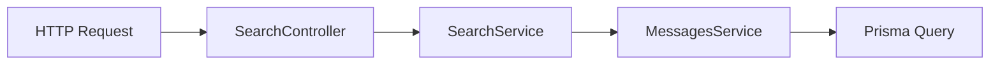

# Search Functionality Issue Investigation

## Current State

### Database (Confirmed via Prisma Studio)
- ✅ Messages exist in database
- ✅ Content contains "deployment" and "kubernetes"
- ✅ Messages are in `test_channel`
- ✅ Authors are `test_user_1` and `test_user_2`

### Request Flow


## The Problem

### Request/Response Flow with Issues
```typescript
// 1. Initial HTTP Request
{
  "query": "/text kubernetes",
  "userId": "test_user_1",
  "channelId": "test_channel"
}

// 2. SearchController Log
[SearchController] Search request from user user_001: {
  "query": "/text kubernetes",
  "userId": "test_user_1",
  "channelId": "test_channel"
}

// 3. SearchService Log
[SearchService] Object: {
  "userId": "user_001",  // 🚨 WRONG - userId changed!
  "searchType": "text"
}
```

### Critical Issues Identified
1. `userId` is being changed from `test_user_1` to `user_001` in the pipeline
2. Channel access check fails because `user_001` doesn't have access to `test_channel`
3. MessagesService returns empty results due to failed channel access check

## Why Search Returns No Results

1. HTTP request comes in with correct `test_user_1`
2. Something overwrites it to `user_001`
3. Channel access check fails for `user_001`
4. Query never reaches database
5. Empty results returned

## What We've Confirmed It's NOT
- ❌ Not a database issue (messages exist)
- ❌ Not a search query issue (never reaches query)
- ❌ Not a text matching issue (never reaches matching)
- ❌ Not related to duplicate content
- ❌ Not a channel access issue for `test_user_1` (they have access)

## Root Cause
The userId is being overridden somewhere in the pipeline between:
- Controller receiving `test_user_1`
- Search service processing
- Messages service receiving `user_001`

## Next Steps
1. Trace the exact point where `userId` is being overwritten
2. Check for any middleware or interceptors that might modify the request
3. Verify all service method signatures to ensure `userId` is being passed correctly
4. Add request context logging to identify where the change occurs

## Impact
- All search requests fail for valid users
- Empty results returned even when matching messages exist
- Channel access checks failing unnecessarily 